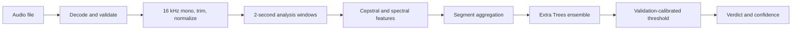
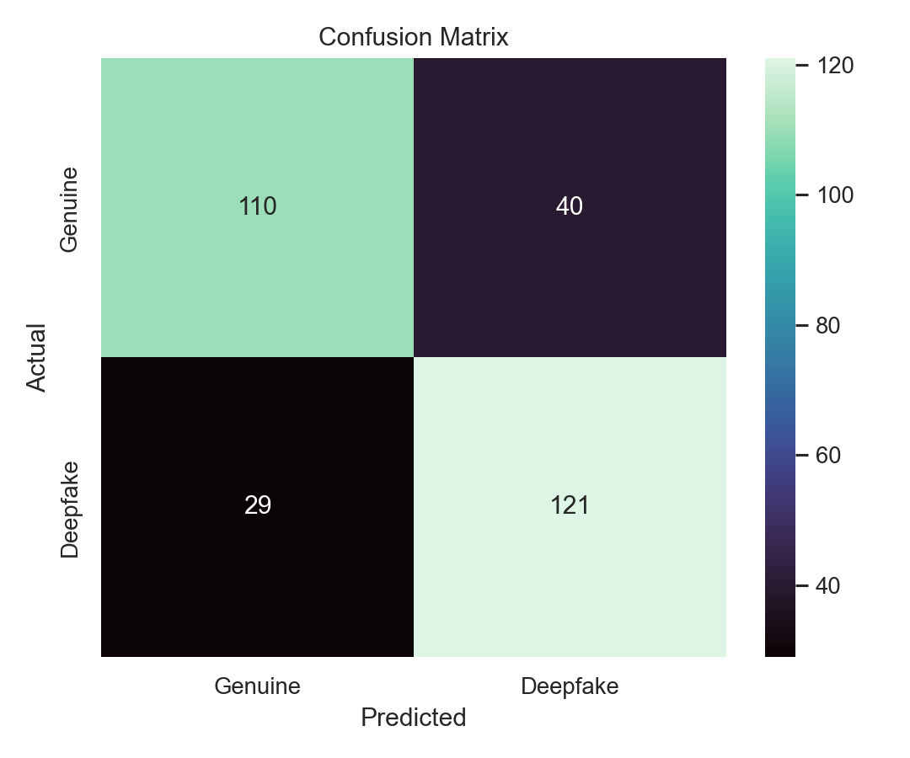
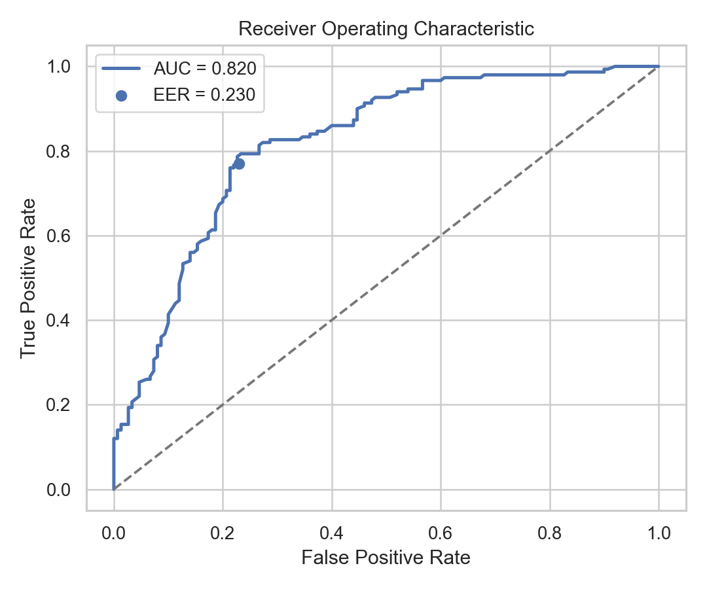

<<<<<<< HEAD
# Auralis - Deepfake Audio Detector

Auralis is an end-to-end audio-forensics system that classifies speech as
**Genuine (Human)** or **Deepfake (AI-Generated)**. It includes reproducible
dataset preparation, signal preprocessing, feature extraction, model training,
held-out evaluation, command-line inference, and a polished Streamlit app.

## Highlights

- WAV, MP3, FLAC, OGG, and M4A decoding
- Defensive mono conversion, 16 kHz resampling, silence trimming, and normalization
- Segment-aware MFCC, delta, log-mel, spectral, harmonic, and temporal features
- Balanced Extra Trees ensemble with a validation-selected operating threshold
- Accuracy, F1, ROC-AUC, confusion matrix, ROC curve, and Equal Error Rate (EER)
- Reproducible balanced sampling from the public Fake-or-Real (FoR) dataset
- Responsive dark Streamlit interface with playback and probability charts

## Architecture



The detector summarizes MFCCs and their first/second derivatives, log-mel
energy, spectral centroid, bandwidth, rolloff, flatness, contrast, chroma,
zero-crossing rate, RMS energy, autocorrelation, crest factor, and clipping.
Statistics are calculated per segment and aggregated across a recording, which
makes inference stable for both short clips and longer uploads.

## Project Structure

```text
.
├── app.py                         # Streamlit web application
├── predict.py                     # Command-line inference
├── train.py                       # Training and evaluation pipeline
├── models/
│   └── deepfake_audio_detector.joblib
├── notebooks/
│   └── deepfake_audio_training.ipynb
├── reports/
│   ├── metrics.json
│   ├── confusion_matrix.png
│   └── roc_curve.png
├── scripts/
│   └── download_for_subset.py
├── src/deepfake_audio/            # Reusable package
├── tests/
├── requirements.txt
└── pyproject.toml
```

## Setup

Python 3.10-3.13 is supported. Python 3.12 is recommended.

```bash
python3 -m venv .venv
source .venv/bin/activate
python -m pip install --upgrade pip
pip install -r requirements.txt
pip install -e .
```

For MP3 support, `soundfile` handles common files directly. If a platform lacks
the required codec, install FFmpeg (`brew install ffmpeg` on macOS or
`sudo apt install ffmpeg` on Ubuntu).

## Use the Trained Model

```bash
python predict.py path/to/recording.wav
python predict.py path/to/recording.mp3 --json
```

Example output:

```text
Prediction : Deepfake
Confidence : 97.20%
Genuine    : 2.80%
Deepfake   : 97.20%
```

The confidence is the winning class probability. It is a screening signal, not
proof of authorship; noisy recordings, aggressive compression, and unseen
generators can reduce reliability.

## Launch the Web App

```bash
streamlit run app.py
```

Open `http://localhost:8501`, drop in a WAV or MP3 recording, play it back, and
review the verdict and probability breakdown.

## Reproduce Training

The complete FoR archive is roughly 20 GB. The downloader reads the remote ZIP
index and fetches only a deterministic balanced subset of the official
`for-norm` train, validation, and test directories:

```bash
python scripts/download_for_subset.py
python train.py
```

Custom local datasets are also supported:

```text
data/raw/
├── train/
│   ├── real/
│   └── fake/
├── validation/
│   ├── real/
│   └── fake/
└── test/
    ├── real/
    └── fake/
```

Training caches extracted features under `data/cache/`. Re-run with
`python train.py --force-features` after changing feature extraction.

## Evaluation

The decision threshold is selected **only on validation data** at the point
where false acceptance and false rejection are closest. Final metrics are then
computed once on the untouched official test split.

| Metric | Held-out test result |
|---|---:|
| Accuracy | See `reports/metrics.json` |
| F1 score | See `reports/metrics.json` |
| ROC-AUC | See `reports/metrics.json` |
| Equal Error Rate | See `reports/metrics.json` |

Generated plots:





## Notebook

`notebooks/deepfake_audio_training.ipynb` is an executable walkthrough of data
inspection, preprocessing, training, threshold selection, evaluation, plots,
and sample inference. It uses the same production modules as the scripts to
prevent notebook/code drift.

## Tests

```bash
pytest -q
```

The suite covers audio validation, resampling, segmentation, deterministic
feature dimensions, EER calculation, metrics, artifact loading, and inference.

## Dataset and Scope

Training uses a deterministic subset of the
[Fake-or-Real dataset](https://www.kaggle.com/datasets/mohammedabdeldayem/the-fake-or-real-dataset)
(`for-norm`, LGPL-3.0). The model is strongest on speech distributions
represented by FoR. For high-stakes deployment, evaluate on recent generators,
telephony codecs, languages, microphones, and adversarial post-processing, then
retrain with representative samples.

=======
# Deepfake-Audio-Detection
>>>>>>> 6ca55600afa743a4a6ad7537e198414dfa20751f
